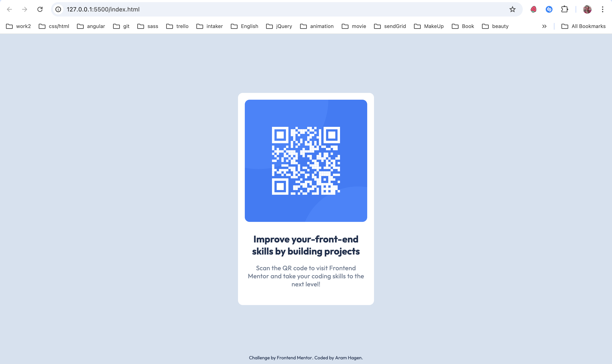
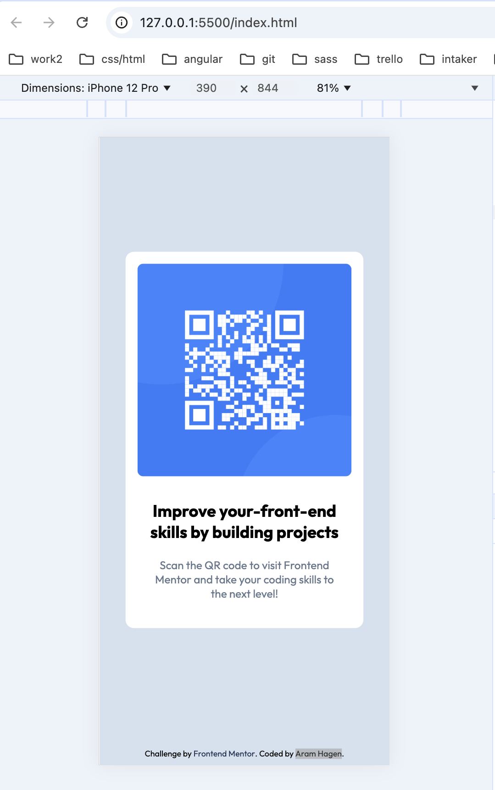

# Frontend Mentor - QR Code Component Solution

This is a solution to the [QR code component challenge on Frontend Mentor](https://www.frontendmentor.io/challenges/qr-code-component-iux_sIO_H). Frontend Mentor challenges help you improve your coding skills by building realistic projects.

## Table of contents

- [Overview](#overview)
  - [Screenshot](#screenshot)
  - [Links](#links)
- [My process](#my-process)
  - [Built with](#built-with)
  - [What I learned](#what-i-learned)

## Overview

### Screenshot



### Links

- Solution URL: [Add solution URL here](https://github.com/AramHagen/qr-code-component)
- Live Site URL: [Add live site URL here](https://aramhagen.github.io/qr-code-component/)

## My process

### Built with
- Semantic HTML5 markup
- CSS custom properties (CSS variables)
- CSS Grid layout
- Sass (SCSS)
- Mobile-first workflow

### What I learnedhttps://github.com/AramHagen/qr-code-component

During this project, I learned how to effectively use CSS Grid to create responsive layouts. By utilizing CSS custom properties, I was able to manage my color palette and breakpoints more efficiently. Here's an example of how I structured my variables in `variables.scss`:

```scss
:root {
  // Colors
  --PattensBlue: #d5e1ef;
  --white: #ffffff;
  --SlateGrey: #68778d;
  --CatalinaBlue: #1f3251;

  // Breakpoints
  --mobileSize: 375px;
  --desktopSize: 1440px;

  // Font weights
  --light: 300;
  --regular: 400;
  --medium: 500;
  --bold: 700;

  // Font family
  --fontFamily: "Outfit", sans-serif;
}
